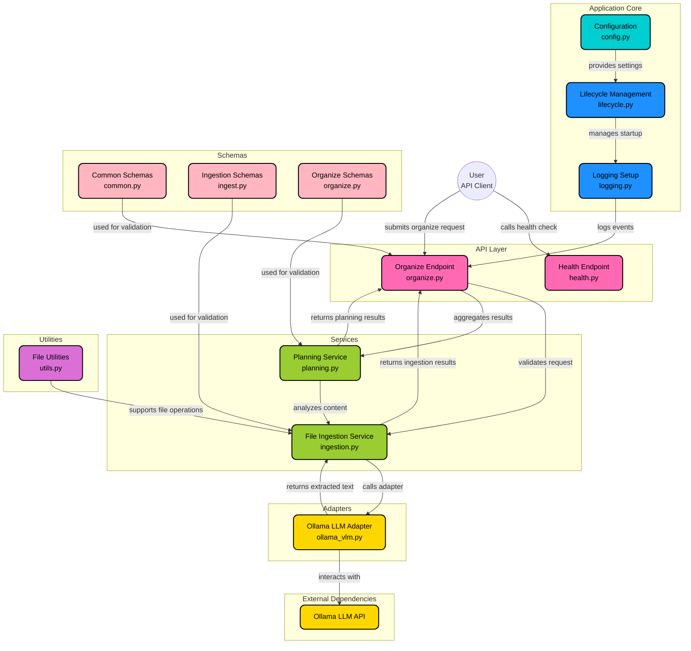

```mermaid
graph TB
%% === STYLES ===
classDef core fill:#1E90FF,stroke:#000,color:#000,stroke-width:2px,rx:10px,ry:10px;
classDef adapter fill:#FFD700,stroke:#000,color:#000,stroke-width:2px,rx:10px,ry:10px;
classDef service fill:#9ACD32,stroke:#000,color:#000,stroke-width:2px,rx:10px,ry:10px;
classDef schema fill:#FFB6C1,stroke:#000,color:#000,stroke-width:2px,rx:10px,ry:10px;
classDef util fill:#DA70D6,stroke:#000,color:#000,stroke-width:2px,rx:10px,ry:10px;
classDef api fill:#FF69B4,stroke:#000,color:#000,stroke-width:2px,rx:10px,ry:10px;
classDef config fill:#00CED1,stroke:#000,color:#000,stroke-width:2px,rx:10px,ry:10px;

%% === USERS ===
User(("User<br/>API Client"))

%% === API LAYER ===
subgraph "API Layer"
  HealthAPI["Health Endpoint<br/>health.py"]:::api
  OrganizeAPI["Organize Endpoint<br/>organize.py"]:::api
end

User -->|"calls health check"| HealthAPI
User -->|"submits organize request"| OrganizeAPI

%% === APPLICATION CORE ===
subgraph "Application Core"
  Config["Configuration<br/>config.py"]:::config
  Lifecycle["Lifecycle Management<br/>lifecycle.py"]:::core
  Logging["Logging Setup<br/>logging.py"]:::core
end

%% === ADAPTERS ===
subgraph "Adapters"
  OllamaAdapter["Ollama LLM Adapter<br/>ollama_vlm.py"]:::adapter
end

%% === SERVICES ===
subgraph "Services"
  IngestionService["File Ingestion Service<br/>ingestion.py"]:::service
  PlanningService["Planning Service<br/>planning.py"]:::service
end

%% === SCHEMAS ===
subgraph "Schemas"
  CommonSchemas["Common Schemas<br/>common.py"]:::schema
  IngestSchemas["Ingestion Schemas<br/>ingest.py"]:::schema
  OrganizeSchemas["Organize Schemas<br/>organize.py"]:::schema
end

%% === UTILITIES ===
subgraph "Utilities"
  FileUtils["File Utilities<br/>utils.py"]:::util
end

%% === DATA FLOW ===
OrganizeAPI -->|"validates request"| IngestionService
IngestionService -->|"calls adapter"| OllamaAdapter
OllamaAdapter -->|"returns extracted text"| IngestionService
IngestionService -->|"returns ingestion results"| OrganizeAPI
OrganizeAPI -->|"aggregates results"| PlanningService
PlanningService -->|"analyzes content"| IngestionService
PlanningService -->|"returns planning results"| OrganizeAPI

Config -->|"provides settings"| Lifecycle
Lifecycle -->|"manages startup"| Logging
Logging -->|"logs events"| OrganizeAPI

CommonSchemas -->|"used for validation"| OrganizeAPI
IngestSchemas -->|"used for validation"| IngestionService
OrganizeSchemas -->|"used for validation"| PlanningService
FileUtils -->|"supports file operations"| IngestionService

%% === EXTERNAL DEPENDENCIES ===
subgraph "External Dependencies"
  OllamaAPI["Ollama LLM API"]:::adapter
end

OllamaAdapter -->|"interacts with"| OllamaAPI
```