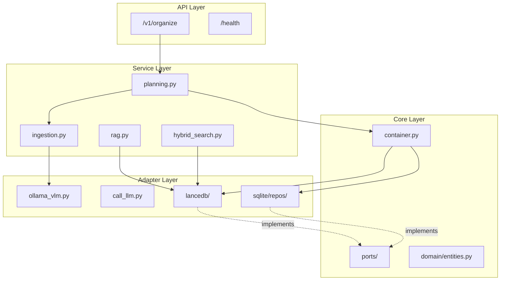
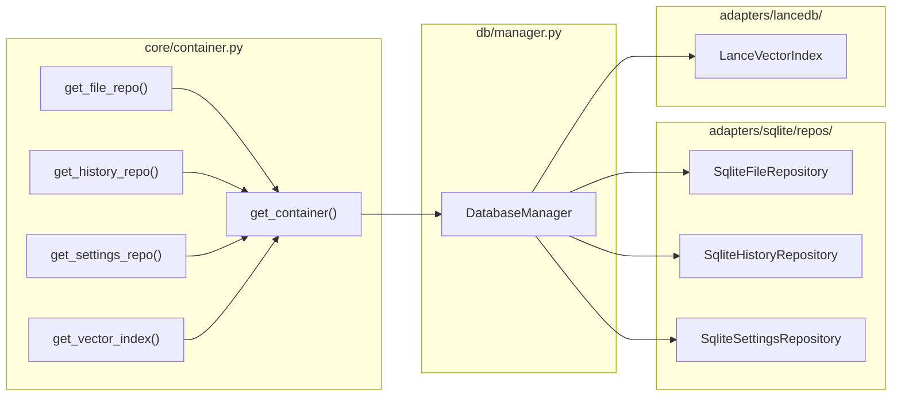
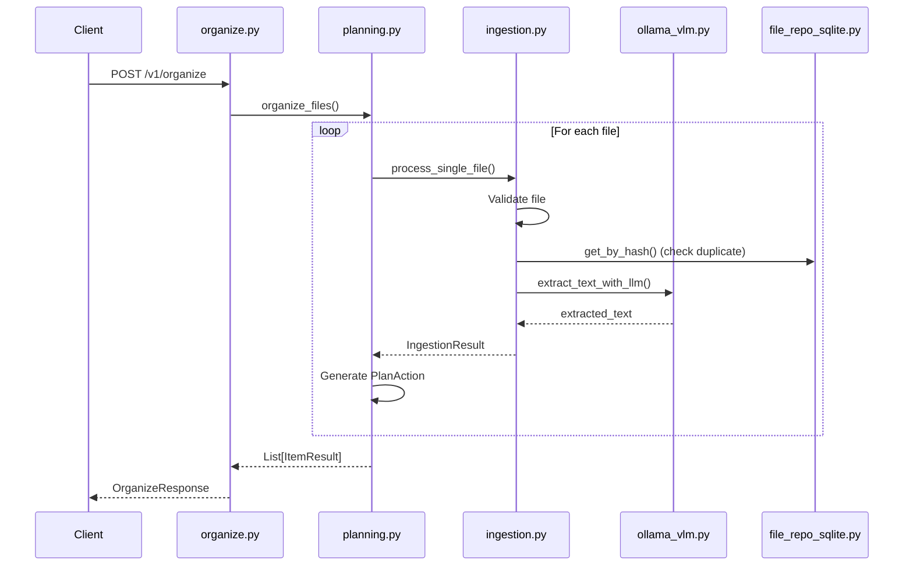
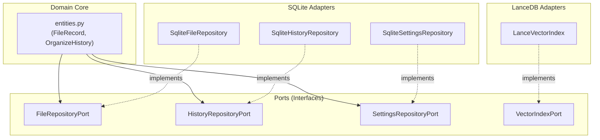
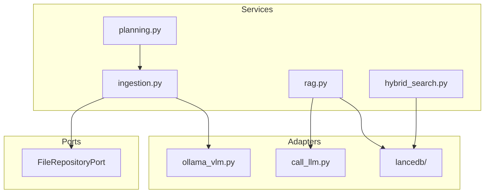

# App Directory Structure

## File Tree

```
app/
├── __init__.py
├── main.py                      # FastAPI application entry point
├── adapters/                    # External service implementations
│   ├── __init__.py
│   ├── call_llm.py              # LLM invocation via Langchain/Ollama
│   ├── ollama_vlm.py            # Vision-Language Model for OCR extraction
│   ├── lancedb/                 # Vector database adapter
│   │   ├── client.py            # LanceDB client connection
│   │   └── vector_index_lance.py # VectorIndexPort implementation
│   └── sqlite/                  # SQLite database adapter
│       ├── database.py          # Database initialization
│       ├── mappers.py           # ORM to domain entity mappers
│       ├── session.py           # Session management
│       ├── crud/                # CRUD operations
│       │   ├── calendar_crud.py
│       │   ├── embeddings_crud.py
│       │   ├── file_crud.py
│       │   ├── history_crud.py
│       │   ├── organize_crud.py
│       │   └── settings_crud.py
│       ├── migrations/          # Alembic database migrations
│       ├── models/              # SQLAlchemy ORM models
│       │   ├── calendar.py
│       │   ├── embeddings.py
│       │   ├── file_record.py
│       │   ├── organize.py
│       │   └── settings.py
│       └── repos/               # Repository implementations
│           ├── file_repo_sqlite.py
│           ├── history_repo_sqlite.py
│           └── settings_repo_sqlite.py
├── api/                         # API layer (FastAPI routers)
│   ├── __init__.py
│   ├── dev_notes/               # Development documentation endpoint
│   │   └── routes.py
│   └── v1/                      # API version 1
│       ├── __init__.py
│       └── routers/
│           ├── health.py        # Health check endpoint
│           └── organize.py      # File organization endpoint
├── core/                        # Core business logic & configuration
│   ├── __init__.py
│   ├── config.py                # Application settings (env vars)
│   ├── container.py             # Dependency injection container
│   ├── lifecycle.py             # Startup/shutdown lifecycle hooks
│   ├── logging.py               # Logging configuration
│   ├── domain/                  # Domain entities (pure Python)
│   │   ├── __init__.py
│   │   └── entities.py          # FileRecord, OrganizeHistory, etc.
│   └── ports/                   # Abstract interfaces (Ports)
│       ├── __init__.py
│       ├── file_repo.py         # FileRepositoryPort protocol
│       ├── history_repo.py      # HistoryRepositoryPort protocol
│       ├── settings_repo.py     # SettingsRepositoryPort protocol
│       └── vector_index.py      # VectorIndexPort protocol
├── db/                          # Database management
│   ├── __init__.py
│   └── manager.py               # DatabaseManager factory
├── schemas/                     # Pydantic request/response schemas
│   ├── __init__.py
│   ├── common.py                # Shared schemas (ItemResult, PlanAction)
│   ├── ingest.py                # IngestOptions schema
│   ├── organize.py              # OrganizeRequest/Response schemas
│   └── summary.py               # Summary-related schemas
├── services/                    # Business logic services
│   ├── __init__.py
│   ├── hybrid_search.py         # Hybrid vector + keyword search
│   ├── ingestion.py             # File text extraction service
│   ├── planning.py              # Organization plan generation
│   └── rag.py                   # RAG (Retrieval-Augmented Generation)
└── utils/                       # Utility functions
    └── __init__.py              # Hash calculation, file helpers
```

---

## Module Descriptions

### `main.py`
**Application entry point.** Initializes FastAPI app with CORS middleware, mounts routers, and manages application lifespan (database init, Ollama connectivity check).

### `adapters/`
**External service implementations.** Contains concrete implementations for databases and LLM services.

| File | Description |
|------|-------------|
| `call_llm.py` | Calls Ollama LLM via Langchain for text processing, JSON extraction |
| `ollama_vlm.py` | Vision-Language Model adapter for OCR/document extraction |
| `lancedb/` | Vector database adapter for semantic search embeddings |
| `sqlite/` | Relational database adapter (SQLAlchemy-based) |

### `api/`
**REST API layer.** Defines FastAPI routers and endpoints.

| Module | Description |
|--------|-------------|
| `v1/routers/health.py` | Health check endpoint (`/health`) |
| `v1/routers/organize.py` | File organization endpoint (`POST /v1/organize`) |
| `dev_notes/routes.py` | Static file serving for documentation |

### `core/`
**Core application logic.** Contains configuration, dependency injection, and domain abstractions.

| File | Description |
|------|-------------|
| `config.py` | Environment-based settings (Ollama URL, model name, etc.) |
| `container.py` | Dependency injection container with lazy singleton pattern |
| `lifecycle.py` | FastAPI lifespan context manager (startup/shutdown) |
| `logging.py` | Structured logging setup |
| `domain/entities.py` | Pure Python domain entities (FileRecord, OrganizeHistory) |
| `ports/` | Abstract protocols defining repository and index interfaces |

### `db/`
**Database management layer.** Orchestrates database initialization and provides unified access.

| File | Description |
|------|-------------|
| `manager.py` | `DatabaseManager` dataclass that wires all repositories together |

### `schemas/`
**Pydantic models** for API request/response validation.

| File | Description |
|------|-------------|
| `common.py` | Shared schemas: `ItemResult`, `PlanAction`, `FileItem` |
| `ingest.py` | `IngestOptions` for file processing configuration |
| `organize.py` | `OrganizeRequest`, `OrganizeResponse` |
| `summary.py` | Summary generation schemas |

### `services/`
**Business logic layer.** Orchestrates adapters to implement features.

| File | Description |
|------|-------------|
| `ingestion.py` | File processing: validates, extracts text via VLM/OCR |
| `planning.py` | Generates organization plans (move/rename suggestions) |
| `hybrid_search.py` | Combines vector similarity with keyword search |
| `rag.py` | RAG pipeline for document embedding and retrieval |

### `utils/`
**Utility functions.** Common helpers like hash calculation, file size checks, extension validation.

---

## Reference Folder Relations

### 1. API → Services → Adapters Flow

The application follows a **layered architecture** with dependency injection:



### 2. Dependency Injection Container

The `container.py` provides lazy singleton access to all repositories:



### 3. Organize Endpoint Flow

Complete request flow for `/v1/organize`:



### 4. Ports & Adapters Pattern

The application uses the **Hexagonal Architecture** pattern:



### 5. Service Layer Dependencies



---

## Key Design Patterns

| Pattern | Implementation |
|---------|----------------|
| **Hexagonal Architecture** | `core/ports/` defines interfaces, `adapters/` provides implementations |
| **Dependency Injection** | `core/container.py` provides singleton repositories via `Depends()` |
| **Repository Pattern** | `adapters/sqlite/repos/` implements data access abstraction |
| **Service Layer** | `services/` contains business logic, orchestrates adapters |
| **Factory Pattern** | `db/manager.py` builds `DatabaseManager` with all dependencies |
