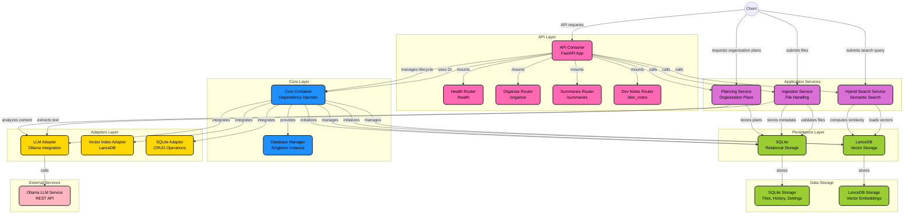

```mermaid
graph TB
%% === STYLES ===
classDef core fill:#1E90FF,stroke:#000,color:#000,stroke-width:2px,rx:10px,ry:10px;
classDef db fill:#9ACD32,stroke:#000,color:#000,stroke-width:2px,rx:10px,ry:10px;
classDef adapter fill:#FFD700,stroke:#000,color:#000,stroke-width:2px,rx:10px,ry:10px;
classDef api fill:#FF69B4,stroke:#000,color:#000,stroke-width:2px,rx:10px,ry:10px;
classDef service fill:#DA70D6,stroke:#000,color:#000,stroke-width:2px,rx:10px,ry:10px;
classDef external fill:#FFB6C1,stroke:#000,color:#000,stroke-width:2px,rx:10px,ry:10px;

%% === USERS ===
User(("Client"))

%% === API LAYER ===
subgraph "API Layer"
  APIContainer["API Container<br/>FastAPI App"]:::api
  HealthRouter["Health Router<br/>/health"]:::api
  OrganizeRouter["Organize Router<br/>/organize"]:::api
  SummariesRouter["Summaries Router<br/>/summaries"]:::api
  DevNotesRouter["Dev Notes Router<br/>/dev_notes"]:::api
end

User -->|"API requests"| APIContainer
APIContainer -->|"mounts"| HealthRouter
APIContainer -->|"mounts"| OrganizeRouter
APIContainer -->|"mounts"| SummariesRouter
APIContainer -->|"mounts"| DevNotesRouter

%% === CORE LAYER ===
subgraph "Core Layer"
  CoreContainer["Core Container<br/>Dependency Injection"]:::core
  DatabaseManager["Database Manager<br/>Singleton Instance"]:::core
end

APIContainer -->|"uses DI"| CoreContainer
CoreContainer -->|"provides"| DatabaseManager

%% === PERSISTENCE LAYER ===
subgraph "Persistence Layer"
  SQLiteDB["SQLite<br/>Relational Storage"]:::db
  LanceDB["LanceDB<br/>Vector Storage"]:::db
end

CoreContainer -->|"manages"| SQLiteDB
CoreContainer -->|"manages"| LanceDB

%% === ADAPTERS LAYER ===
subgraph "Adapters Layer"
  LLMAdapter["LLM Adapter<br/>Ollama Integration"]:::adapter
  VectorIndexAdapter["Vector Index Adapter<br/>LanceDB"]:::adapter
  SQLiteAdapter["SQLite Adapter<br/>CRUD Operations"]:::adapter
end

CoreContainer -->|"integrates"| LLMAdapter
CoreContainer -->|"integrates"| VectorIndexAdapter
CoreContainer -->|"integrates"| SQLiteAdapter

%% === APPLICATION SERVICES ===
subgraph "Application Services"
  IngestionService["Ingestion Service<br/>File Handling"]:::service
  PlanningService["Planning Service<br/>Organization Plans"]:::service
  HybridSearchService["Hybrid Search Service<br/>Semantic Search"]:::service
end

APIContainer -->|"calls"| IngestionService
APIContainer -->|"calls"| PlanningService
APIContainer -->|"calls"| HybridSearchService

%% === DATA FLOW ===
User -->|"submits files"| IngestionService
IngestionService -->|"validates files"| SQLiteDB
IngestionService -->|"extracts text"| LLMAdapter
IngestionService -->|"stores metadata"| SQLiteDB

User -->|"requests organization plans"| PlanningService
PlanningService -->|"analyzes content"| LLMAdapter
PlanningService -->|"stores plans"| SQLiteDB

User -->|"submits search query"| HybridSearchService
HybridSearchService -->|"loads vectors"| LanceDB
HybridSearchService -->|"computes similarity"| LanceDB

%% === EXTERNAL DEPENDENCIES ===
subgraph "External Services"
  OllamaService["Ollama LLM Service<br/>REST API"]:::external
end

LLMAdapter -->|"calls"| OllamaService

%% === DATA STORAGE ===
subgraph "Data Storage"
  SQLiteStorage["SQLite Storage<br/>Files, History, Settings"]:::db
  LanceDBStorage["LanceDB Storage<br/>Vector Embeddings"]:::db
end

SQLiteDB -->|"stores"| SQLiteStorage
LanceDB -->|"stores"| LanceDBStorage

%% === MISC ===
CoreContainer -->|"initializes"| SQLiteDB
CoreContainer -->|"initializes"| LanceDB

APIContainer -->|"manages lifecycle"| CoreContainer

```
