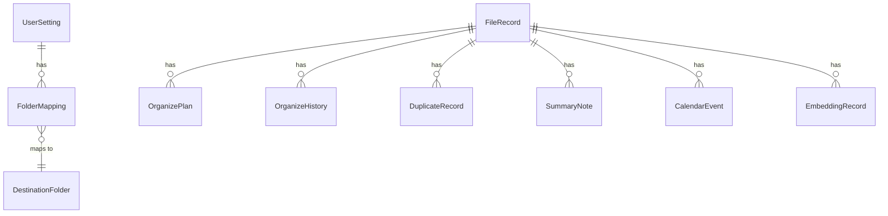

# **Low-Level Design (LLD) / Database Design**

---

# **Entities Identified**

The system requires lightweight local storage because the application processes files on the user’s device and must not store sensitive file contents.
Entities focus on:

### **Core Entities**

1. **FileRecord**
   Tracks file metadata before and after organize actions.

2. **OrganizePlan**
   Stores actions proposed by AI (rename, move, delete).

3. **OrganizeHistory**
   Actual operations executed (supports Undo/Redo).

4. **DuplicateRecord**
   Stores duplicate detection results, file hashes, and similarity groups.

5. **UserSetting**
   Stores user config: model settings, watcher folders, destination folders.

6. **FolderMapping**
   Defines category-to-folder mapping (AI classification → actual folder path).

7. **SummaryNote**
   AI-generated notes, summaries, or extracted key insights.

8. **CalendarEvent**
   Events generated from file content (e.g., meetings, due dates).

9. **EmbeddingRecord** 
   Stores embeddings for semantic search or file-content similarity.

---

# **ER Diagram (High-Level)**

```
UserSetting (1) ────────< FolderMapping >──────── (∞) DestinationFolder

FileRecord (1) ────────< OrganizePlan >──────── (∞)
FileRecord (1) ────────< OrganizeHistory >──── (∞)

FileRecord (1) ────────< DuplicateRecord >──── (∞)

FileRecord (1) ────────< SummaryNote >──────── (∞)
FileRecord (1) ────────< CalendarEvent >────── (∞)

FileRecord (1) ────────< EmbeddingRecord >──── (∞)
```



### Notes:

* **FileRecord** is the central entity.
* **OrganizePlan** = predicted actions from AI
* **OrganizeHistory** = actions executed by worker
* **EmbeddingRecord** exists only if RAG or semantic search is enabled

---

# **Logical Database Schema (Relational View)**

This schema is optimized for SQLite (default for desktop apps).

---

### **Table: file_records**

| Field         | Type     | Description                     |
| ------------- | -------- | ------------------------------- |
| id (PK)       | INTEGER  | Unique ID                       |
| original_path | TEXT     | Absolute path before organizing |
| current_path  | TEXT     | Path after organizing           |
| filename      | TEXT     | Original file name              |
| new_filename  | TEXT     | AI suggested name               |
| file_hash     | TEXT     | SHA-256 for duplicate detection |
| category      | TEXT     | AI-classified document category |
| created_at    | DATETIME | Timestamp                       |
| updated_at    | DATETIME | Timestamp                       |

---

### **Table: organize_plans**

| Field          | Type     |                                  |
| -------------- | -------- | -------------------------------- |
| id (PK)        | INTEGER  |                                  |
| file_id (FK)   | INTEGER  |                                  |
| action_type    | TEXT     | move / rename / delete / summary |
| suggested_path | TEXT     |                                  |
| suggested_name | TEXT     |                                  |
| reason         | TEXT     | LLM explanation                  |
| created_at     | DATETIME |                                  |

---

### **Table: organize_history**

| Field        | Type     |                  |
| ------------ | -------- | ---------------- |
| id (PK)      | INTEGER  |                  |
| file_id (FK) | INTEGER  |                  |
| old_path     | TEXT     |                  |
| new_path     | TEXT     |                  |
| old_name     | TEXT     |                  |
| new_name     | TEXT     |                  |
| action_type  | TEXT     |                  |
| status       | TEXT     | success / failed |
| timestamp    | DATETIME |                  |

---

### **Table: duplicate_records**

| Field            | Type     |                     |
| ---------------- | -------- | ------------------- |
| id (PK)          | INTEGER  |                     |
| file_id (FK)     | INTEGER  |                     |
| duplicate_of     | INTEGER  | file_id of original |
| similarity_score | FLOAT    |                     |
| created_at       | DATETIME |                     |

---

### **Table: folder_mappings**

| Field            | Type    |
| ---------------- | ------- |
| id (PK)          | INTEGER |
| category         | TEXT    |
| destination_path | TEXT    |

---

### **Table: user_settings**

| Field               | Type        |
| ------------------- | ----------- |
| id (PK)             | INTEGER     |
| watcher_folders     | TEXT (JSON) |
| destination_folders | TEXT (JSON) |
| model_config        | TEXT (JSON) |
| preferences         | TEXT (JSON) |

---

### **Table: summary_notes**

| Field        | Type        |
| ------------ | ----------- |
| id (PK)      | INTEGER     |
| file_id (FK) | INTEGER     |
| summary      | TEXT        |
| keywords     | TEXT (JSON) |
| created_at   | DATETIME    |

---

### **Table: calendar_events**

| Field        | Type     |
| ------------ | -------- |
| id (PK)      | INTEGER  |
| file_id (FK) | INTEGER  |
| title        | TEXT     |
| event_date   | DATE     |
| description  | TEXT     |
| created_at   | DATETIME |

---

### **Table: embeddings**

| Field        | Type     |
| ------------ | -------- |
| id (PK)      | INTEGER  |
| file_id (FK) | INTEGER  |
| vector       | BLOB     |
| algorithm    | TEXT     |
| created_at   | DATETIME |

---

# **Physical Schema (Indexes, Performance, Storage)**

### **Indexes**

To improve performance for thousands of files:

| Table             | Index               | Purpose                  |
| ----------------- | ------------------- | ------------------------ |
| file_records      | INDEX(file_hash)    | Fast duplicate detection |
| file_records      | INDEX(category)     | Quick category filtering |
| organize_history  | INDEX(timestamp)    | Fast sorting/filtering   |
| folder_mappings   | INDEX(category)     | Quick mapping lookup     |
| duplicate_records | INDEX(duplicate_of) | Cluster grouping         |

---

### **Storage Strategy**

* SQLite database stored in:
  `~/.file-organizer/organizer.db`
* Indexes auto-managed by SQLite
* Embeddings stored as **BLOB**, optionally compressed

---

### **Performance Notes**

* Duplicate scan uses `file_hash` + size check
* Large text fields stored efficiently (SQLite TEXT is optimized)
* Heavy files or documents are **never** stored in DB

---